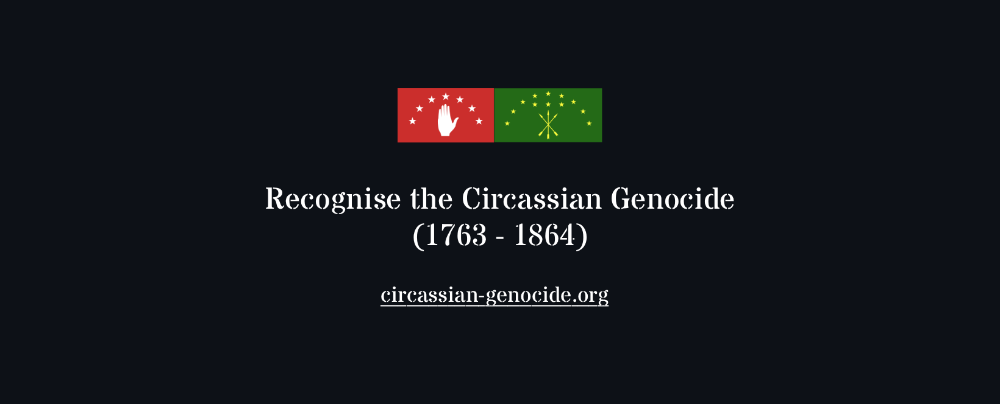

## Hi there, welcome to my page 👋  
Hello my name is Abed, I am a final year Software & Information Systems Engineering student at Ben-Gurion University of the Negev, also working as an R&D Software Developer in the Cyber-Security domains.  
Currently based in Beer Sheva, originally from Kfar Kama.   
I enjoy solving problems, alwqays striving to find a better solution and contribute as much as possible to my field of work.  

## Fesapş, Kéblağ si nequbğe 👋
Se Abed siše, Ḱfar Ḱamem sışepsewı, Programatiḱere Research ofxemre saxelejahı.  
Se Universitym sışége yiĺes yawjırem sixet, arti Beer Sheva sıdesı thamafem yiqućge.   
Adıǵabzem yeğepxiğo ofxeme sapılejehne si net, zegorege collaboration şüfayeme ye gupşısexe şüi'aexeme mésaj kısfejüğah!   
Thaşüeyğepsew

  

)

