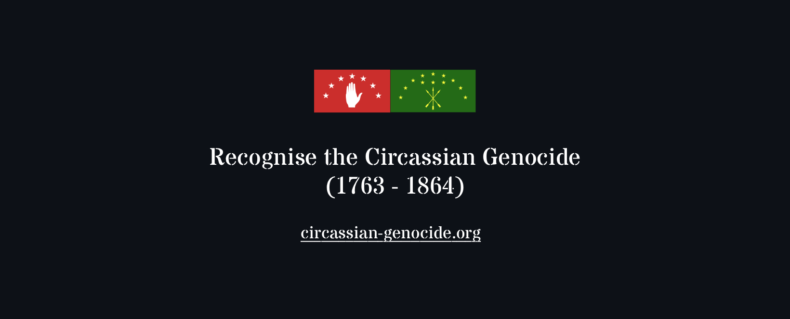
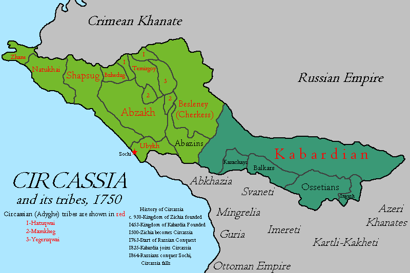

## Hello, welcome to my page 👋  
Hello my name is Abed, I am a final year Software & Information Systems Engineering student at Ben-Gurion University of the Negev, also working as an R&D Software Developer in the Cyber-Security domains.  .   
I enjoy solving problems, always striving to find a better solution and contribute as much as possible to my fields of work.  

## Fesapş, Kéblağ si nequbğe 👋
Se siše Abed, Ḱfar Ḱamem sışepsewı,  
BGU Universitem sışége "Software & Information Systems Engineering" yawjıre yiĺesım sıxet aş riğuso program ğepsınre txınre ofxer selejıx.

### ***ADİǴE ĹEPK ĞEQOD - АДЫГЭ ЛЪЭПКЪ ГЪЭК1УЭД*** 

  
 *Махэр Абазэ сурэтэр ий - credit to abaza738*
  
### ***ADİǴE XEḰU - АДЫГЭ ХЭКУ***  

